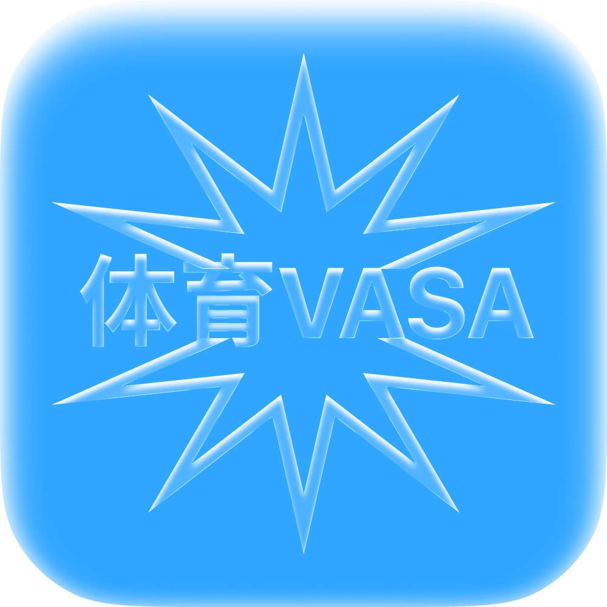
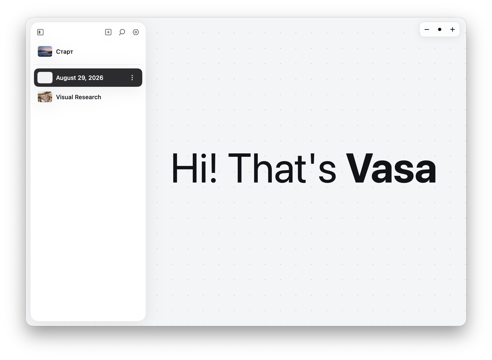
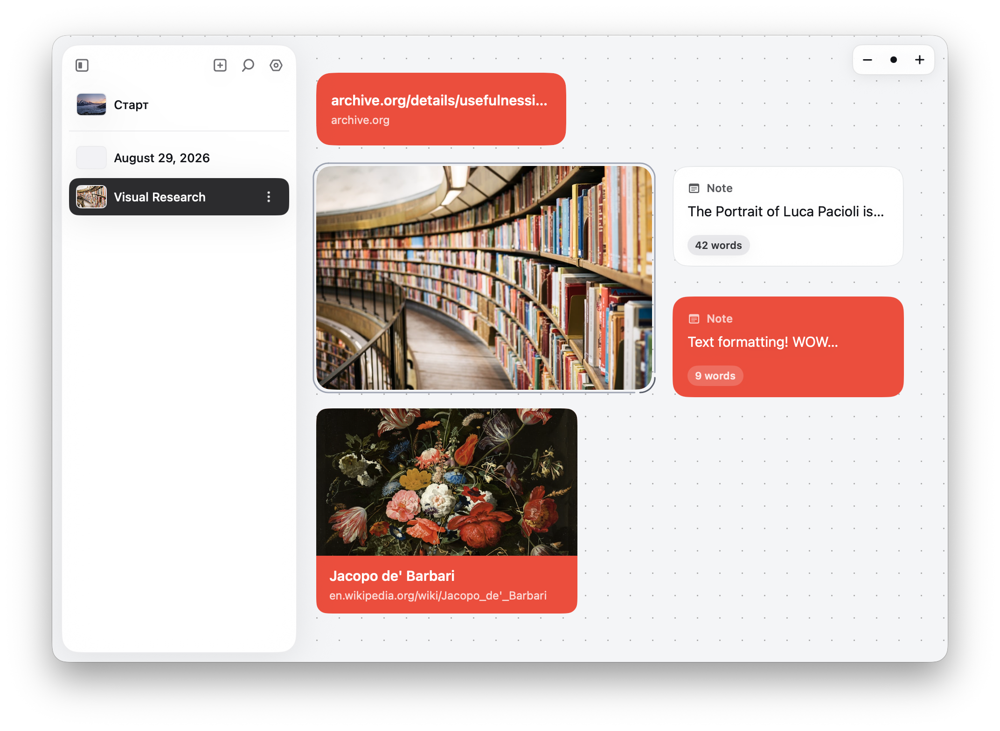
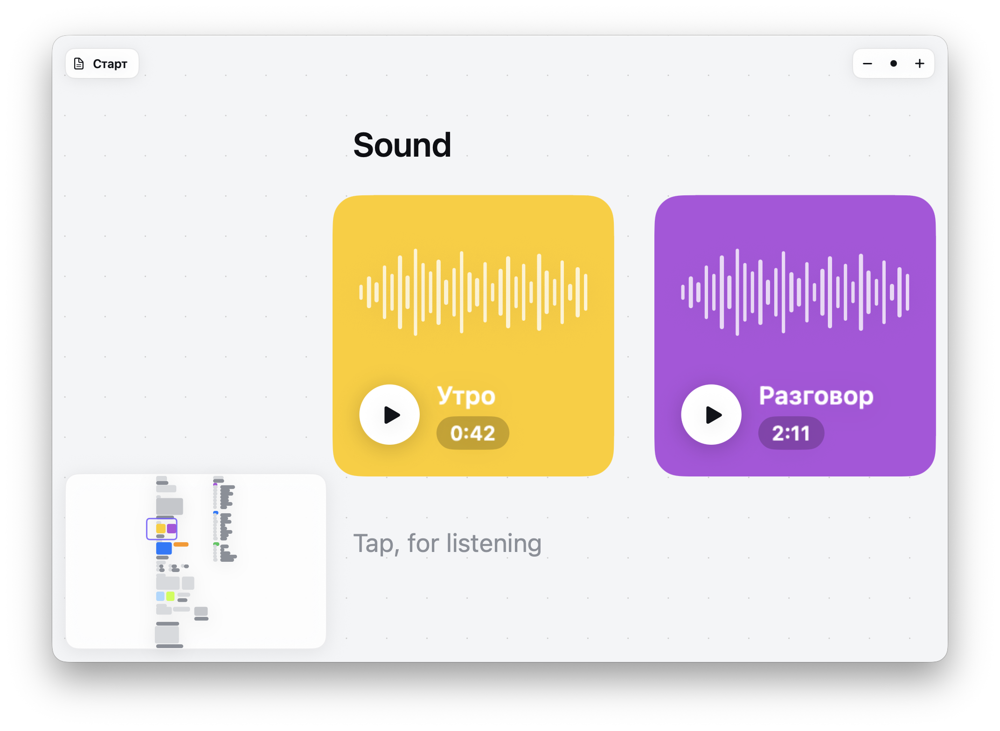

<div align="center">



# Vasa.

**Drop a thought. Watch it stay.**\
A native macOS infinite canvas for notes, images, links, and video — one quiet workspace instead of a stack of tabs.

[](macos/Vasa/Vasa.xcodeproj)
[](https://swift.org)
[](LICENSE)

</div>

<p align="center">
  
</p>

Vasa is a native macOS app for people who think by spreading things out — text, notes, images, links, audio, video, and freehand ink — all on one pannable, zoomable canvas instead of buried in folders and windows.

It is local-first. Your library lives on your Mac under `~/Documents/Vasa Library`. AI features are opt-in through a provider you choose in Settings, never a requirement to open the app.

---

## What is this, really?

Vasa is an infinite canvas that lives on your Mac, not in a browser tab.

A Vasa **project** is a board — a `.zoom`-able space you fill with cards. Every card is a first-class object: text, a sticky note, an image, a link, a clip of audio, a video, a YouTube embed, a folder, a shortcut, or freehand ink. Same canvas, same drag-and-drop, same snap-to-grid, whatever you drop on it.

Under the hood it's a SwiftUI app with an arrange engine that snaps cards to each other the way Figma snaps layers — vertical and horizontal guides, equal-gap detection, the works. In practice it feels like a corkboard that never runs out of room and never loses a pin.

Yes, it's another canvas app. There are a few of those now. The difference is that Vasa stays on your machine — no account, no sync wall, no web runtime — and treats every media type as a native citizen instead of an attachment bolted onto a text block.

---

## Stuff you do in Vasa

- **Start a project the way you'd start a notebook.** Open a blank canvas, drop the first card, and let the board grow the way your thinking does — not the way a template dictates.
- **Pull research together without fifty browser tabs.** Drag in links, images, and PDFs; they land as cards you can group, resize, and connect on the same board.
- **Sketch when a sentence is too slow.** Switch to the pen, mark up a screenshot or draw straight onto the canvas, then keep working around it.
- **Keep audio and video in the room with your notes.** A voice memo, a YouTube clip, a video file — they sit next to the note that explains why they matter.
- **Ask an AI provider you configured, not one that configured itself.** Bring your own DeepSeek (or another provider from the catalog) key for prompts against your board's content — nothing leaves your Mac until you turn it on.

---

## A look inside

<table>
  <tr>
    <td colspan="2" valign="top">
      <br>
      <sub><strong>A canvas, not a document.</strong> Pan, zoom, and drop the first card wherever the thought starts.</sub>
    </td>
  </tr>
  <tr>
    <td width="50%" valign="top">
      <br>
      <sub><strong>Research that stays visual.</strong> Images, notes, and links live side by side, grouped the way you actually think about them.</sub>
    </td>
    <td width="50%" valign="top">
      <br>
      <sub><strong>Sound as a first-class card.</strong> Waveforms, playback, and a minimap for boards that grow past the viewport.</sub>
    </td>
  </tr>
</table>

---

## Why Vasa is better

One canvas, one file format, no login. Text, notes, images, links, audio, video, and ink all speak the same card protocol, drag the same way, and snap to the same guides. The bet is that a single native board can replace the pile of screenshots-folder, browser-tabs, and sticky-notes apps that currently fake a research workspace — without shipping your library to a server to do it.

---

## Works today · Being wired up

| ✅ Works today | 🚧 Being wired up |
|---|---|
| Infinite pan/zoom canvas, Figma-style snap guides | Additional AI providers in the catalog |
| Text, note, image, link, audio, video, YouTube, folder, shortcut, draw, group cards | Deeper AI prompt workflows over board content |
| Local-first library under `~/Documents/Vasa Library` | |
| Settings: appearance, sounds, haptics, grid, snapping | |
| Release `.dmg` packaging via `scripts/build-native-macos.sh` | |

---

## Getting started

### I just want to try the app

Build the Release `.dmg` from source (there's no signed release yet):

```bash
./scripts/build-native-macos.sh          # current machine's arch
./scripts/build-native-macos.sh arm64
./scripts/build-native-macos.sh x86_64
```

This packages `release/Vasa-<version>-<arch>-native.dmg` (plus a copy of `release/Vasa-native.app`).

### I want to build & run from source

Requirements: macOS 14+, Xcode 15+

```bash
open macos/Vasa/Vasa.xcodeproj
```

or headless:

```bash
xcodebuild -project macos/Vasa/Vasa.xcodeproj -scheme Vasa -configuration Debug
```

No API keys required to run the core app — AI providers are configured per-user in Settings.

---

## Shape of the code

| Area | Role |
|------|------|
| `Canvas/` | Pan/zoom canvas, arrange engine, text tool |
| `Cards/` | Card rendering, selection chrome, inline text editing |
| `Chrome/` | Sidebar, note editor, overlays, settings |
| `Models/` | Library, persistence, playback, AI providers, settings |
| `RootView.swift` / `VasaApp.swift` | App entry and window composition |

Data: `~/Documents/Vasa Library`.

---

## Principles

1. **The canvas is the app.** Everything else is chrome around it.
2. **Local beats clever.** Cloud is opt-in, not the default tax.
3. **One card, one job.** No attachment ever hides inside a text block.
4. **Snapping should feel invisible.** You align by dragging, not by fighting a ruler.

---

## License

Apache License 2.0 — see [LICENSE](LICENSE).

---

*Open. Drop a card. Keep thinking.*

---

### Inspired by

Vasa is an infinite-canvas alternative to tools like [Kosmik](https://www.kosmik.app) for people who want their moodboard, research board, and second brain on native macOS instead of the web — plus a nod to [EMA App](https://ema.co) for the calm, quiet interaction design.
